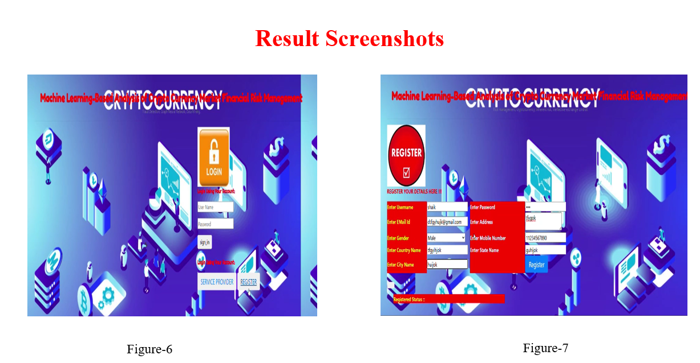

# Machine-learning-based-analysis-of-cryptocurrency-market-financial-risk-management-
ML models assess crypto market risks using sentiment analysis, real-time data &amp; predictive tools to aid smarter, safer financial decisions.

